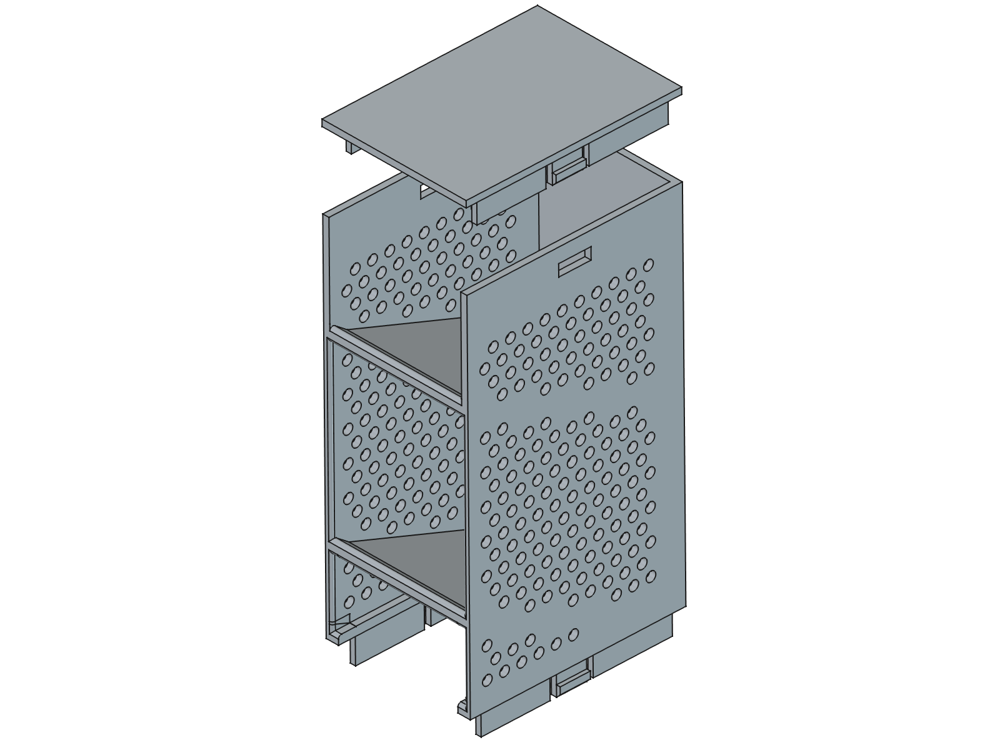

# fixed-angled-drawer — 적층형 경사 필통

책상 모서리에 클램프로 고정하고, 같은 규격의 모듈을 위로 계속 쌓아 올리는 경사형 필통입니다.
FreeCAD 파이썬 스크립트 하나(`pen_holder.py`)가 모든 부품을 파라메트릭하게 생성하고, 치수·형상·출력성을 자체 검증합니다.


## 특징

- **흔들리지 않는 고정** — 1단 뒷면에 책상 모서리를 감싸는 ㄷ자 클램프가 일체로 붙어 있고, 썸스크류로 상판을 물어 조입니다. 높이 쌓아도 흔들리지 않습니다.
- **무한 적층** — 모든 모듈의 높이(170mm)와 결합 인터페이스가 동일해서, 2칸·3칸 모듈을 어떤 순서로든 원하는 높이까지 쌓을 수 있습니다. 맨 위는 마감 모듈이나 평판 뚜껑으로 닫습니다.
- **적층 시 공간이 이어짐** — 적층 모듈의 하단이 열려 있어, 아래 모듈의 맨 위 칸과 공간이 연결됩니다. 긴 자·붓도 걸리지 않습니다.
- **서포트 없이 출력** — 뒷면을 베드에 대면 앞턱·클램프·결합부가 모두 자기지지 형상이라 서포트가 사실상 필요 없습니다.
- **측벽 타공** — 벌집 배열 타공이 측벽의 빈 영역에만 들어가 밋밋함을 덜고 무게를 줄입니다.

## 부품 구성


| 부품 | STL | 높이 | 칸 수 | 역할 |
|------|-----|------|-------|------|
| 1단 (바닥 모듈) | `output/tier1.stl` | 170mm | 3칸 | 맨 아래. 뒷면에 책상 클램프 + 암나사 일체형 |
| 적층 모듈 2칸 | `output/module2.stl` | 170mm | 2칸 (피치 85mm) | 긴 물건용 (자, 붓, 긴 가위) |
| 적층 모듈 3칸 | `output/module3.stl` | 170mm | 3칸 (피치 56.7mm) | 촘촘한 분류용 (펜, 지우개, 클립) |
| 마감 모듈 | `output/topmodule.stl` | 56.7mm | 바닥 없음 · 천장 일체 | 맨 위 마감용 한 부품. 윗면이 평평 |
| 평판 뚜껑 | `output/lid.stl` | 3mm | — | 2칸·3칸 모듈 위를 그대로 덮는 별도 뚜껑 |
| 썸스크류 | `output/thumbscrew.stl` | 34mm | — | 클램프 조임 나사 1개 |

최소 구성은 `tier1` + `thumbscrew` 두 개이고, 원하는 높이만큼 `module2`/`module3`을 추가로 출력해 쌓습니다.

**맨 위 마감 — 두 가지 방법**

1. **마감 모듈(`topmodule`)을 올린다** — 천장이 일체로 붙은 한 부품이라 이것만 얹으면 끝납니다. 바닥이 없어 아래 모듈의 맨 위 칸과 공간이 이어지고(그만큼 깊은 수납), 자신의 천장이 그 공간을 덮습니다. 스택 높이는 56.7mm만 늘어납니다.
2. **평판 뚜껑(`lid`)만 덮는다** — 높이를 3mm만 더하는 가장 얇은 마감입니다. 모듈 바닥과 똑같은 스냅 구조라 2칸·3칸 모듈 위에 그대로 딸깍 걸립니다.



위 그림은 2칸 모듈 위에서 뚜껑을 들어 올린 모습입니다. 뚜껑 아래로 내려온 스냅 스커트가 모듈 상단의 캐치 창에 걸려 고정됩니다 — 모듈끼리 쌓이는 방식과 완전히 동일합니다.

## 치수 사양

| 항목 | 값 |
|------|-----|
| 모듈 외형 (폭 × 깊이 × 높이) | 70 × 100 × 170mm |
| 마감 모듈 (천장 포함) | 70 × 100 × 56.7mm (= 3칸 모듈의 한 칸) |
| 선반 경사각 | 수평 대비 20° |
| 벽 두께 / 바닥판 / 선반 | 3 / 4 / 4mm |
| 앞턱 | 높이 3mm, 기저 8mm 램프 (베드 대비 53.5°) |
| 타공 | Ø4.5mm, 피치 8mm 벌집 배열 |
| 클램프 개구 (책상 상판 두께) | 40mm → 상판 18~25mm 대응 |
| 나사 규격 | 외경 18.5 / 골 12.7 / 피치 4 / 나사부 22mm |
| 적층 공차 / 나사 공차 | 0.25 / 0.4mm |
| 1단 전체 높이 (클램프 포함) | 224mm |

## 출력 가이드 (FDM)

**출력 방향이 가장 중요합니다. 통 부품은 모두 뒷면(등)을 베드에 붙여 눕혀서 출력하세요.** 이 방향에서만 클램프·앞턱·결합부가 모두 자기지지가 되어 서포트가 필요 없습니다.

| 부품 | 놓는 방향 | 그 방향의 서포트 면적 | 다른 방향 (참고) |
|------|-----------|----------------------|------------------|
| `tier1` | 뒷면 아래로 | 3,641mm² | 직립 28,849 / 앞면 17,117 |
| `module2` | 뒷면 아래로 | 4,077mm² | 직립 17,435 / 앞면 14,753 |
| `module3` | 뒷면 아래로 | 3,713mm² | 직립 23,696 / 앞면 14,165 |
| `topmodule` | 뒷면 아래로 | 1,562mm² | 직립 8,356 / 앞면 4,972 |
| `lid` | **뒤집어 평판이 베드에** | 50mm² | 그대로 놓으면 6,622 |
| `thumbscrew` | 손잡이 아래로 | 754mm² (나사산 하면) | — |

수치는 하향면 45° 기준으로 STL에서 광선 투사로 실측한 값입니다(폭 70mm 기준). 권장 방향에 남는 면적은 **Ø4.5mm 타공 구멍의 상단 아치**와 **썸스크류 나사산 하면**뿐인데, 둘 다 FDM이 서포트 없이 처리하는 크기입니다. 슬라이서가 굳이 서포트를 넣으려 하면 오버행 임계값을 55°로 올리세요.

**뚜껑(`lid.stl`)만 방향이 다릅니다.** 평판 아래로 스냅 스커트가 튀어나온 모양이라 슬라이서에서 **뒤집어 평판이 베드에 닿게** 놓아야 합니다. 그대로 놓으면 서포트가 130배로 늘어납니다.

- **재료**: PLA / PETG 모두 무난합니다. 클램프에 조임 하중이 걸리므로 PETG나 ABS가 더 여유 있습니다.
- **레이어**: 0.2mm, 벽 3줄 이상 권장. 스냅 후크에 힘이 걸리므로 벽을 얇게 하지 마세요.
- **공차 조정**: 스냅이 너무 빡빡하거나 헐거우면 `CLEAR`(기본 0.25mm), 나사가 안 돌아가면 `THR_CLEAR`(기본 0.4mm)를 프린터에 맞춰 조정 후 재생성하세요.

## 조립 방법

1단을 책상 모서리에 걸고 썸스크류로 조인 다음, 모듈을 위에서 눌러 끼우는 순서입니다. 모듈의 바닥 스커트에 있는 스냅 돌기가 아래 모듈 상단의 캐치 창에 딸깍 걸립니다.

```
1단을 책상 모서리에 걸기 → 썸스크류를 아래턱 암나사에 조임 (상판 아래를 눌러 고정)
        ↓
모듈을 1단 위에 얹고 수직으로 누름 → 스냅 돌기가 캐치 창에 걸리며 딸깍 고정
        ↓
원하는 높이까지 모듈 반복 적층 (2칸·3칸 순서 자유)
        ↓
맨 위에 마감 모듈을 얹어 마감 (+56.7mm) 또는 평판 뚜껑만 덮기 (+3mm)
```

분리할 때는 위 모듈을 잡고 좌우 측벽을 살짝 벌리면서 위로 당깁니다. 반복 분해는 후크 마모를 유발하니 자주 바꿔 끼우지 않는 편이 좋습니다.

## 모델 재생성

파라미터를 바꾼 뒤 스크립트를 실행하면 검증을 거쳐 STL·FCStd가 다시 생성됩니다. 검증이 하나라도 실패하면 마지막 줄에 `VERIFICATION FAIL`이 찍히므로, 출력 전에 이 줄을 반드시 확인하세요.

```bash
# 모델 생성 + 검증 + STL/FCStd 내보내기 (헤드리스)
/Applications/FreeCAD.app/Contents/Resources/bin/freecadcmd pen_holder.py

# 스크린샷 PNG 5장 재생성 (GUI가 잠깐 떴다 닫힘)
/Applications/FreeCAD.app/Contents/MacOS/FreeCAD screenshot.py
```

```
파라미터 수정 → freecadcmd pen_holder.py → 검증 19항목 → VERIFICATION PASS → STL·FCStd 출력
                                              ↓ 실패
                                        FAIL 항목 출력 (출력물 사용 금지)
```

검증 항목은 유효 솔리드(6종), 바운딩박스(6종), 마감 모듈 높이, 마감 모듈 바닥 개방·천장 일체, 나사·스냅 정합, 앞턱 자기지지 각도, 앞면 필렛, 타공 배치까지 19가지입니다.

### 주요 파라미터

모두 `pen_holder.py` 상단에 모여 있습니다.

| 파라미터 | 기본값 | 설명 |
|----------|--------|------|
| `W` / `D` / `H` | 70 / 100 / 170 | 모듈 외형. `H`는 전 부품 공통이어야 적층이 호환됩니다 |
| `TIER1_SLOTS` | 3 | 1단 칸 수 |
| `MODULE_SLOTS` | (2, 3) | 생성할 적층 모듈 변형. 예: `(2, 3, 4)`로 4칸 추가 |
| `ANGLE` | 20 | 선반 경사각 |
| `LIP` / `LIP_BASE` | 3 / 8 | 앞턱 높이와 램프 기저. `LIP_BASE > LIP` 필수 (자기지지 조건) |
| `PERFORATE` / `PERF_D` / `PERF_PITCH` | True / 4.5 / 8 | 측벽 타공 on/off·지름·간격 |
| `CLEAR` / `THR_CLEAR` | 0.25 / 0.4 | 스냅 공차 / 나사 공차 |
| `OPENING` | 40 | 클램프 개구 — 책상 상판이 두꺼우면 키우세요 |
| `TOP_H` / `LID_T` | H/3 (56.7) / 3 | 마감 모듈 전체 높이 / 천장·뚜껑판 두께 |

## 파일 구조

```
pen_holder.py          모델 생성·검증·내보내기 (파라메트릭, 단일 소스)
screenshot.py          FCStd → PNG 스크린샷 (FreeCAD GUI 필요)
output/
  tier1.stl            1단 3칸 + 클램프
  module2.stl          적층 모듈 2칸
  module3.stl          적층 모듈 3칸
  topmodule.stl        마감 모듈 (바닥 없음·천장 일체)
  lid.stl              평판 뚜껑
  thumbscrew.stl       썸스크류
  pen_holder.FCStd     FreeCAD 문서 (부품 나열 뷰 + 조립 뷰 배치)
  shot-*.png           스크린샷 5장 (부품·조립 3방향·뚜껑 분해)
output-8cm/            폭 80mm 초기 버전 산출물 (보관용)
reference/             설계 근거로 실측한 참고 STL (출력용 아님)
```

`output-8cm/`은 폭 80mm였던 초기 버전의 산출물입니다. 실제로 출력해 보니 폭이 넓어 70mm로 줄였고, 8cm판이 필요하면 `W = 80.0`으로 되돌려 재생성하면 됩니다.

`output/*.stl`은 모두 원점 기준으로 내보내므로 슬라이서에 그대로 올리면 됩니다. `pen_holder.FCStd`의 부품 배치는 문서 안에서만 적용된 것이라 STL 좌표에 영향이 없습니다.

## 참고 뷰

| 정면 | 측면 |
|------|------|
|  |  |
