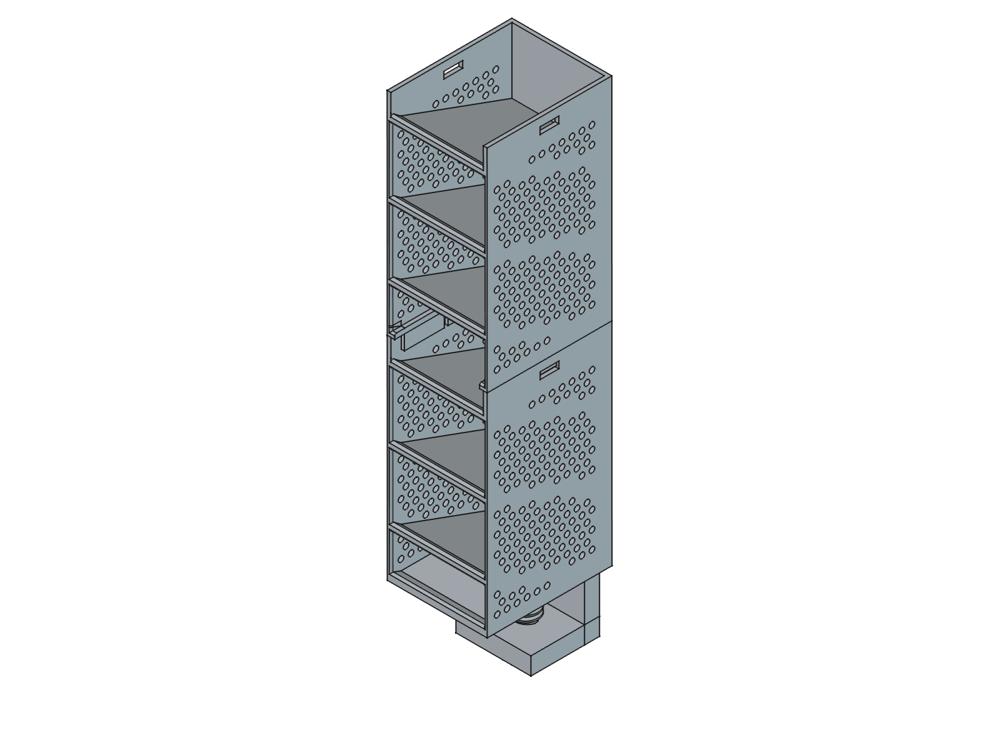
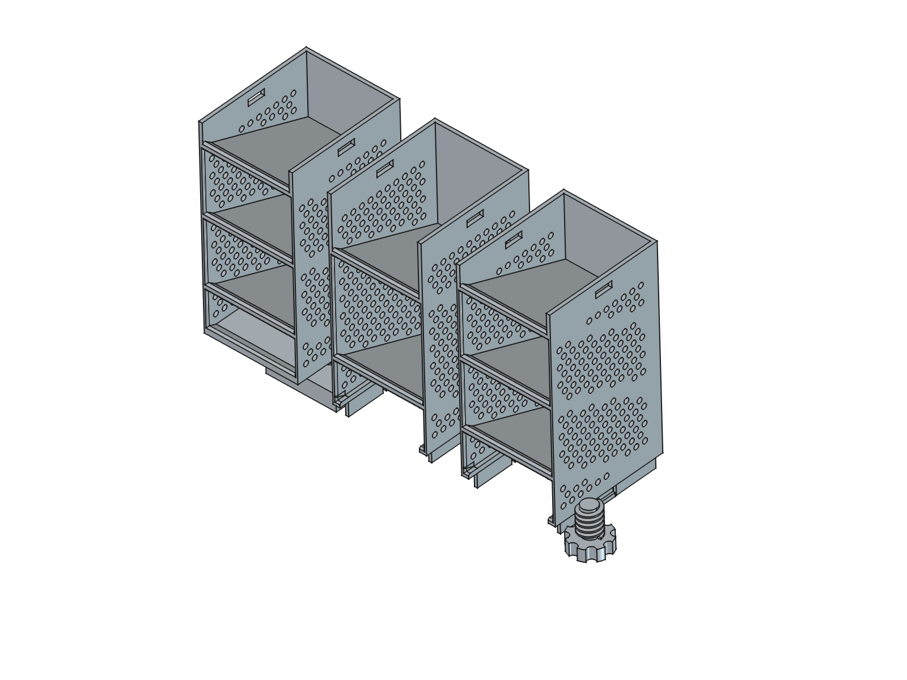
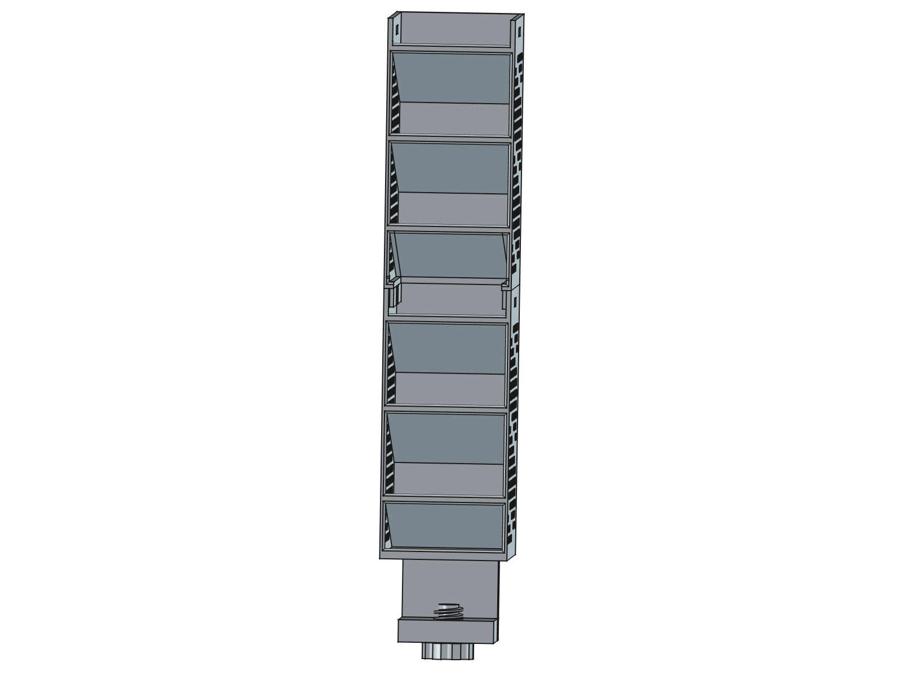
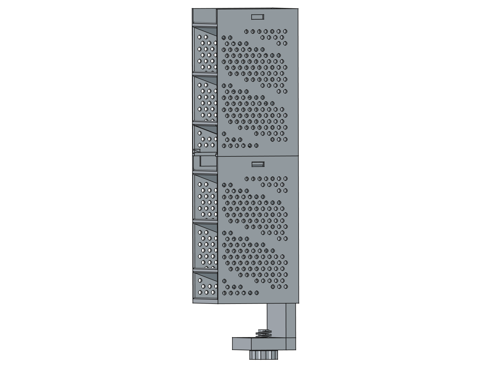

# fixed-angled-drawer — 적층형 경사 필통

책상 모서리에 클램프로 고정하고, 같은 규격의 모듈을 위로 계속 쌓아 올리는 경사형 필통입니다.
FreeCAD 파이썬 스크립트 하나(`pen_holder.py`)가 모든 부품을 파라메트릭하게 생성하고, 치수·형상·출력성을 자체 검증합니다.



## 특징

- **흔들리지 않는 고정** — 1단 뒷면에 책상 모서리를 감싸는 ㄷ자 클램프가 일체로 붙어 있고, 썸스크류로 상판을 물어 조입니다. 높이 쌓아도 흔들리지 않습니다.
- **무한 적층** — 모든 모듈의 높이(170mm)와 결합 인터페이스가 동일해서, 2칸·3칸 모듈을 어떤 순서로든 원하는 높이까지 쌓을 수 있습니다.
- **적층 시 공간이 이어짐** — 적층 모듈의 하단이 열려 있어, 아래 모듈의 맨 위 칸과 공간이 연결됩니다. 긴 자·붓도 걸리지 않습니다.
- **서포트 없이 출력** — 뒷면을 베드에 대면 앞턱·클램프·결합부가 모두 자기지지 형상이라 서포트가 사실상 필요 없습니다.
- **측벽 타공** — 벌집 배열 타공이 측벽의 빈 영역에만 들어가 밋밋함을 덜고 무게를 줄입니다.

## 부품 구성



| 부품 | STL | 칸 수 | 칸 피치 | 역할 |
|------|-----|-------|---------|------|
| 1단 (바닥 모듈) | `output/tier1.stl` | 3칸 | 56.7mm | 맨 아래. 뒷면에 책상 클램프 + 암나사 일체형 |
| 적층 모듈 2칸 | `output/module2.stl` | 2칸 | 85mm | 긴 물건용 (자, 붓, 긴 가위) |
| 적층 모듈 3칸 | `output/module3.stl` | 3칸 | 56.7mm | 촘촘한 분류용 (펜, 지우개, 클립) |
| 썸스크류 | `output/thumbscrew.stl` | — | — | 클램프 조임 나사 1개 |

최소 구성은 `tier1` + `thumbscrew` 두 개이고, 원하는 높이만큼 `module2`/`module3`을 추가로 출력해 쌓습니다.

## 치수 사양

| 항목 | 값 |
|------|-----|
| 모듈 외형 (폭 × 깊이 × 높이) | 80 × 100 × 170mm |
| 선반 경사각 | 수평 대비 20° |
| 벽 두께 / 바닥판 / 선반 | 3 / 4 / 4mm |
| 앞턱 | 높이 3mm, 기저 8mm 램프 (베드 대비 53.5°) |
| 타공 | Ø4.5mm, 피치 8mm 벌집 배열 |
| 클램프 개구 (책상 상판 두께) | 40mm → 상판 18~25mm 대응 |
| 나사 규격 | 외경 18.5 / 골 12.7 / 피치 4 / 나사부 22mm |
| 적층 공차 / 나사 공차 | 0.25 / 0.4mm |
| 1단 전체 높이 (클램프 포함) | 224mm |

## 출력 가이드 (FDM)

**출력 방향이 가장 중요합니다. 반드시 뒷면(등)을 베드에 붙여 눕혀서 출력하세요.** 이 방향에서만 클램프·앞턱·결합부가 모두 자기지지가 되어 서포트가 필요 없습니다. 방향별로 실측한 서포트 필요 면적은 다음과 같습니다.

| 출력 방향 | 서포트 필요 면적 (module3 / tier1) | 판정 |
|-----------|-----------------------------------|------|
| **뒷면 아래로** | 3,713 / 3,641mm² (거의 전부 타공 구멍 상단 아치) | 권장 |
| 직립 (바닥 아래로) | 26,802 / 32,813mm² | 사용 금지 |
| 앞면 아래로 | 15,793 / 18,708mm² | 사용 금지 |

권장 방향에 남는 면적은 Ø4.5mm 타공 구멍의 상단 아치뿐입니다. 이 크기는 FDM에서 서포트 없이 브리징되는 범위이므로, 슬라이서가 서포트를 넣으려 하면 오버행 임계값을 55°로 올리세요.

- **재료**: PLA / PETG 모두 무난합니다. 클램프에 조임 하중이 걸리므로 PETG나 ABS가 더 여유 있습니다.
- **레이어**: 0.2mm, 벽 3줄 이상 권장. 스냅 후크에 힘이 걸리므로 벽을 얇게 하지 마세요.
- **공차 조정**: 스냅이 너무 빡빡하거나 헐거우면 `CLEAR`(기본 0.25mm), 나사가 안 돌아가면 `THR_CLEAR`(기본 0.4mm)를 프린터에 맞춰 조정 후 재생성하세요.

## 조립 방법

1단을 책상 모서리에 걸고 썸스크류로 조인 다음, 모듈을 위에서 눌러 끼우는 순서입니다. 모듈의 바닥 스커트에 있는 스냅 돌기가 아래 모듈 상단의 캐치 창에 딸깍 걸립니다.

```
1단을 책상 모서리에 걸기 → 썸스크류를 아래턱 암나사에 조임 (상판 아래를 눌러 고정)
        ↓
모듈을 1단 위에 얹고 수직으로 누름 → 스냅 돌기가 캐치 창에 걸리며 딸깍 고정
        ↓
원하는 높이까지 모듈 반복 적층 (2칸·3칸 순서 자유)
```

분리할 때는 위 모듈을 잡고 좌우 측벽을 살짝 벌리면서 위로 당깁니다. 반복 분해는 후크 마모를 유발하니 자주 바꿔 끼우지 않는 편이 좋습니다.

## 모델 재생성

파라미터를 바꾼 뒤 스크립트를 실행하면 검증을 거쳐 STL·FCStd가 다시 생성됩니다. 검증이 하나라도 실패하면 마지막 줄에 `VERIFICATION FAIL`이 찍히므로, 출력 전에 이 줄을 반드시 확인하세요.

```bash
# 모델 생성 + 검증 + STL/FCStd 내보내기 (헤드리스)
/Applications/FreeCAD.app/Contents/Resources/bin/freecadcmd pen_holder.py

# 스크린샷 PNG 4장 재생성 (GUI가 잠깐 떴다 닫힘)
/Applications/FreeCAD.app/Contents/MacOS/FreeCAD screenshot.py
```

```
파라미터 수정 → freecadcmd pen_holder.py → 검증 13항목 → VERIFICATION PASS → STL·FCStd 출력
                                              ↓ 실패
                                        FAIL 항목 출력 (출력물 사용 금지)
```

검증 항목은 유효 솔리드(4종), 바운딩박스(4종), 나사·스냅 정합, 앞턱 자기지지 각도, 앞면 필렛, 타공 배치까지 13가지입니다.

### 주요 파라미터

모두 `pen_holder.py` 상단에 모여 있습니다.

| 파라미터 | 기본값 | 설명 |
|----------|--------|------|
| `W` / `D` / `H` | 80 / 100 / 170 | 모듈 외형. `H`는 전 부품 공통이어야 적층이 호환됩니다 |
| `TIER1_SLOTS` | 3 | 1단 칸 수 |
| `MODULE_SLOTS` | (2, 3) | 생성할 적층 모듈 변형. 예: `(2, 3, 4)`로 4칸 추가 |
| `ANGLE` | 20 | 선반 경사각 |
| `LIP` / `LIP_BASE` | 3 / 8 | 앞턱 높이와 램프 기저. `LIP_BASE > LIP` 필수 (자기지지 조건) |
| `PERFORATE` / `PERF_D` / `PERF_PITCH` | True / 4.5 / 8 | 측벽 타공 on/off·지름·간격 |
| `CLEAR` / `THR_CLEAR` | 0.25 / 0.4 | 스냅 공차 / 나사 공차 |
| `OPENING` | 40 | 클램프 개구 — 책상 상판이 두꺼우면 키우세요 |

## 파일 구조

```
pen_holder.py          모델 생성·검증·내보내기 (파라메트릭, 단일 소스)
screenshot.py          FCStd → PNG 스크린샷 (FreeCAD GUI 필요)
output/
  tier1.stl            1단 3칸 + 클램프
  module2.stl          적층 모듈 2칸
  module3.stl          적층 모듈 3칸
  thumbscrew.stl       썸스크류
  pen_holder.FCStd     FreeCAD 문서 (부품 나열 뷰 + 조립 뷰 배치)
  shot-*.png           스크린샷 4장
reference/             설계 근거로 실측한 참고 STL (출력용 아님)
```

`output/*.stl`은 모두 원점 기준으로 내보내므로 슬라이서에 그대로 올리면 됩니다. `pen_holder.FCStd`의 부품 배치는 문서 안에서만 적용된 것이라 STL 좌표에 영향이 없습니다.

## 참고 뷰

| 정면 | 측면 |
|------|------|
|  |  |
